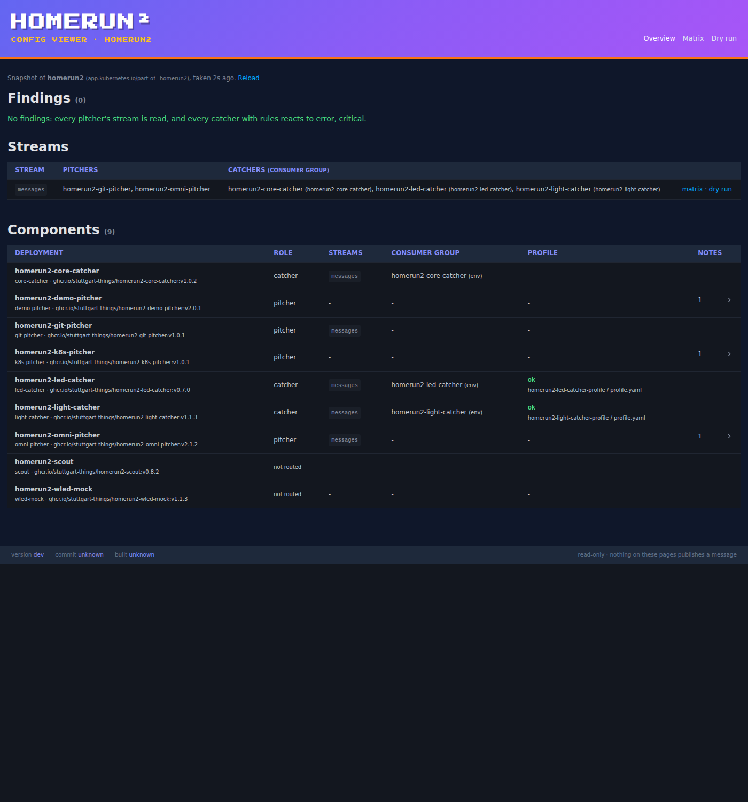
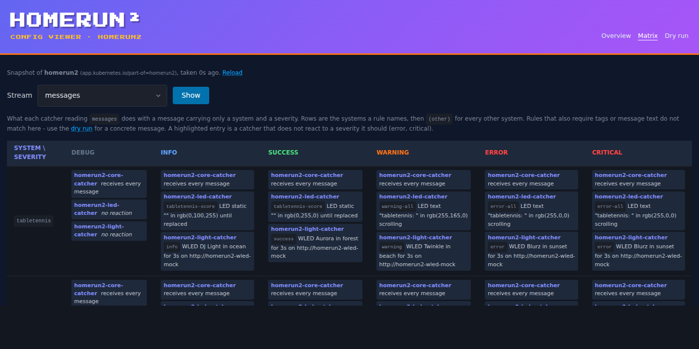
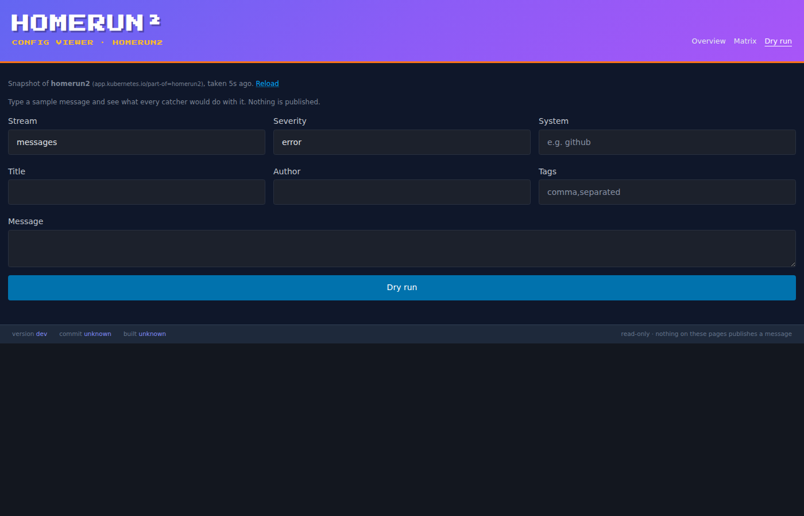

# homerun2-config-viewer

Read-only view of which homerun2 alert triggers what in which catcher.

What a message does in a homerun2 cluster is decided in two places nobody can see at a glance:

1. **Which catcher sees it at all.** That depends on the streams (`REDIS_STREAMS` / `REDIS_STREAM`) and the `CONSUMER_GROUP` each component runs with. A pitcher on a stream no catcher reads still reports success.
2. **What the catcher does with it.** That depends on a profile whose schema differs per catcher: light-catcher effects, led-catcher display rules, notification-catcher outputs.

`homerun2-config-viewer` reads both from the Kubernetes API and shows them in one place: the Deployments labeled `app.kubernetes.io/part-of=homerun2` and the profile ConfigMaps they mount. It **never talks to Redis, never reads Secrets and never publishes a message**. Rule evaluation comes from the [`routing`](https://github.com/stuttgart-things/homerun-library/blob/main/docs/routing.md) package of homerun-library, which mirrors the catchers' own matching code.

Background: [stuttgart-things/homerun-library#122](https://github.com/stuttgart-things/homerun-library/issues/122).

## Pages

| Overview | Matrix | Dry run |
|---|---|---|
|  |  |  |

- **`/` Overview**
  - findings, worst first
  - streams: who publishes to each, who reads it; a stream nobody reads is highlighted
  - components: streams, consumer group, profile status, notes
- **`/matrix`** — severity × system for one stream: what each catcher reading it does. A catcher that does not react to a severity it should is highlighted as a gap.
- **`/dryrun`** — type a sample message and see what every catcher would do, including *"this message reaches nobody"*.

The pages are server-rendered and work without JavaScript. The same data is available as JSON under `/api/*`, see [docs/usage.md](docs/usage.md).

## Findings

| Kind | Means |
|---|---|
| `pod-cannot-start` | a ConfigMap the pod requires (envFrom, keyRef, profile volume) does not exist |
| `unread-stream` | a pitcher publishes to a stream no catcher reads |
| `shared-consumer-group` | different catchers read a stream in the same consumer group, so each message reaches only one of them |
| `uncovered-severity` | a catcher with rules does not react to a must-react severity (`MUST_REACT_SEVERITIES`) |
| `broken-rule` | a rule matches but cannot act, e.g. an unknown WLED effect, or a severity rendered white |
| `profile-missing` | a catcher's profile file does not exist, and what the catcher then does |
| `profile-unresolved` | where a profile comes from cannot be read (relative path, non-ConfigMap volume, path from a Secret) |
| `streams-unknown` | a component's streams depend on a value the viewer cannot resolve |
| `scaled-to-zero` | a pitcher or catcher with `replicas: 0` |

## Configuration

| Variable | Default | Description |
|---|---|---|
| `HTTP_PORT` | `8080` | Port for the pages, the API and `/healthz` |
| `NAMESPACE` | — | Namespace to read. Falls back to `POD_NAMESPACE`, then the service account namespace. **Startup fails if none is set**: reading the wrong namespace would show a confidently wrong picture |
| `LABEL_SELECTOR` | `app.kubernetes.io/part-of=homerun2` | Selects the homerun2 Deployments |
| `KUBECONFIG` | *(empty)* | Kubeconfig for running outside a cluster; empty means in-cluster |
| `CACHE_TTL` | `10s` | How long a snapshot of the namespace is reused; `0` rebuilds on every request |
| `MUST_REACT_SEVERITIES` | `error,critical` | Severities every catcher with rules should react to; empty disables that check |
| `LOG_FORMAT` | `json` | `json` or `text` |
| `LOG_LEVEL` | `info` | `debug`, `info`, `warn`, `error` |

Every invalid value is reported at once, and startup fails.

## RBAC

The viewer needs a namespace-scoped Role, nothing more:

```yaml
rules:
  - apiGroups: ["apps"]
    resources: ["deployments"]
    verbs: ["get", "list"]
  - apiGroups: [""]
    resources: ["configmaps"]
    verbs: ["get", "list"]
```

It needs no `secrets`, no `watch` and no ClusterRole. A value that comes from a Secret is shown as unresolved.

## Run locally

```bash
KUBECONFIG=~/.kube/my-cluster NAMESPACE=homerun2 LOG_FORMAT=text go run .
# http://localhost:8080
```

Without a reachable cluster the service still starts: `/healthz` answers, and the pages and API explain why there is nothing to show (`503`).

## Deployment

KCL manifests live in [`kcl/`](kcl/): Deployment, Service, ServiceAccount, Role and RoleBinding, ConfigMap and an optional HTTPRoute. They are published as a kustomize OCI base, `ghcr.io/stuttgart-things/homerun2-config-viewer-kustomize`. See [docs/deployment.md](docs/deployment.md).

```bash
task render-manifests-local     # kcl + yq
task push-kustomize-base        # needs GITHUB_USER / GITHUB_TOKEN
```

## Development

```bash
go test ./...                    # unit tests, no cluster needed (fake clientset)
golangci-lint run
task smoke-test                  # builds the binary, checks /healthz and the 503 without a cluster

# discovery against a real cluster, read-only
KUBECONFIG=~/.kube/my-cluster NAMESPACE=homerun2 \
  go test -tags cluster -run TestDiscover_Cluster -v ./internal/discovery/
```

See [docs/cicd.md](docs/cicd.md) for the Dagger functions and workflows, and [CLAUDE.md](CLAUDE.md) for the code layout and conventions.

## Limits

These are stated plainly, because a viewer that is confidently wrong is worse than none:

- **HTTP targets are matched to omni-pitcher by name.** A pitcher's URL has to name omni-pitcher's Service as `<name>`, `<name>.<namespace>` or `<name>.<namespace>.svc…`. Every homerun2 KCL base names the Service like its Deployment, and the viewer's Role cannot list Services, so a Service with another name, or a port other than the Service's, is not detected.
- **k8s-pitcher's profile is checked the way k8s-pitcher checks it.** When k8s-pitcher changes that validation, the viewer has to follow.
- **A dry run from a pitcher that writes to a stream itself publishes the message as typed.** git- and k8s-pitcher normally build their messages from GitHub and Kubernetes events; the dry run answers "what if they sent this one". Through omni-pitcher, the message is validated, defaulted and routed the way omni-pitcher's `/pitch` does it.
- **Runtime stream switches are invisible.** led-catcher's `/streams` endpoint changes the streams it reads inside the running pod; the viewer only sees the Deployment.
- **Matrix cells** carry only a system and a severity, so rules that also require tags or message text do not match there. Use the dry run for a concrete message.
- **led-catcher text templates** are rendered only for plain `{{ variable }}`. Anything with Jinja2 filters or statements is shown raw.
- **Environment values** that come from a Secret, a `$(VAR)` expansion or a pod field are not evaluated; they are shown as unresolved.
- **The rule evaluators mirror each catcher's matching code.** When a catcher changes how it matches, homerun-library `routing` must change too, or the viewer describes behaviour the catcher no longer has.

## Links

- [homerun-library `routing`](https://github.com/stuttgart-things/homerun-library/blob/main/docs/routing.md)
- [Tracking issue #11](https://github.com/stuttgart-things/homerun2-config-viewer/issues/11)

## License

Licensed under the Apache License, Version 2.0.
